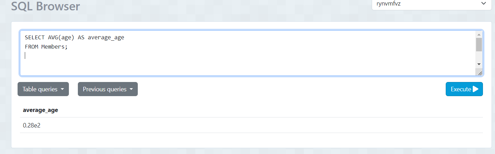

# FUNCIONES SEGREGACIÓN.
## INSTRUCCIONES:
### 1.- Obtener la edad promedio de los miembros:

- Sentencia: 
 ```
SELECT AVG(age) AS average_age FROM Members;

  ```
 - Captura: 

 

---

### 2.- Obtener la edad mínima de los miembros:
- Sentencia: 
```
SELECT MIN(age) AS minimum_age
FROM Members;

```
- Captura:


---
### 3.- Obtener el número total de registros asistidos:
- Sentencia: 
```
SELECT COUNT(*) AS total_registrations
FROM Registrations;
```
- Captura:


---

### 4.-Obtener el número total de asistentes a todas las conferencias:
- Sentencia: 
```

```
- Captura:


---

### 5.-Obtener el número total de eventos por cada ciudad:
- Sentencia: 
```
SELECT city, COUNT(*) AS total_events
FROM Events
GROUP BY city;

```
- Captura:


---

### 6.-Obtener el número de registros por cada miembro:
- Sentencia: 
```
SELECT member_id, COUNT(*) AS registrations_count
FROM Registrations
GROUP BY member_id;

```
- Captura:


---

### 7.-Obtener el número de registros por cada conferencia:
- Sentencia: 
```

```
- Captura:
  


---


